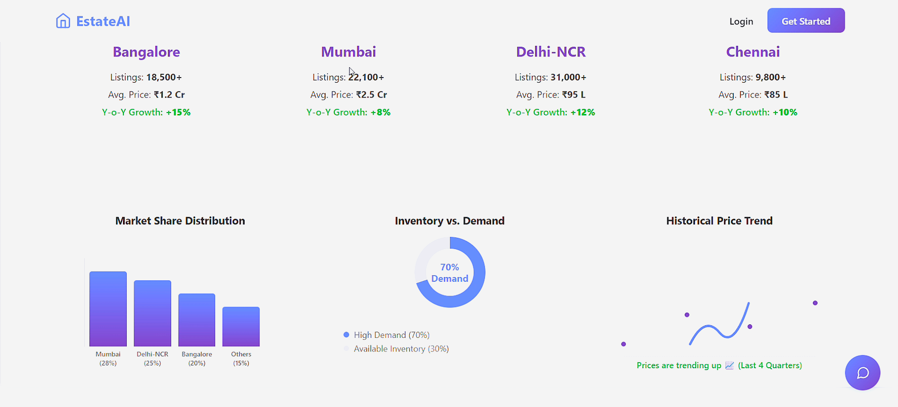
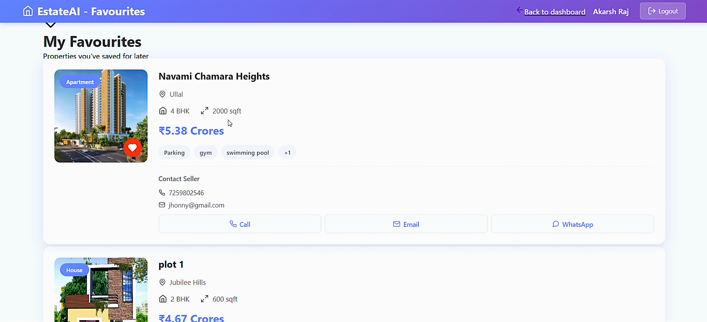
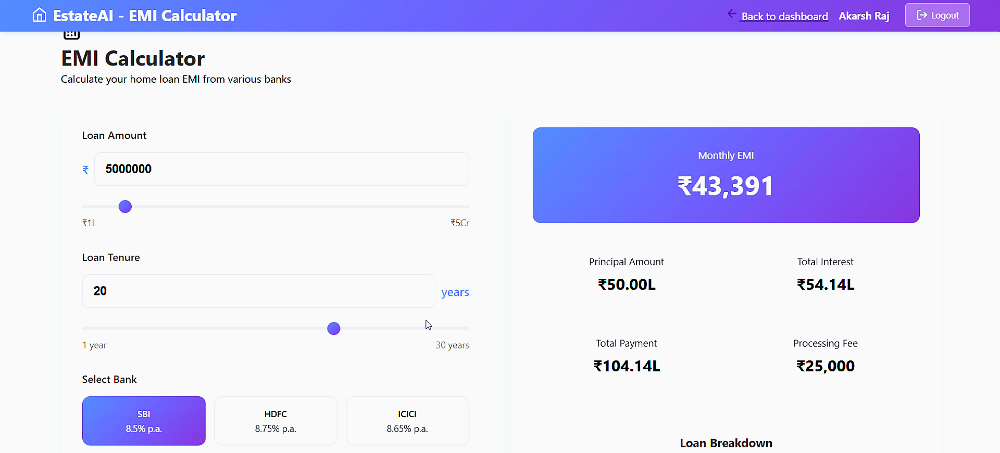
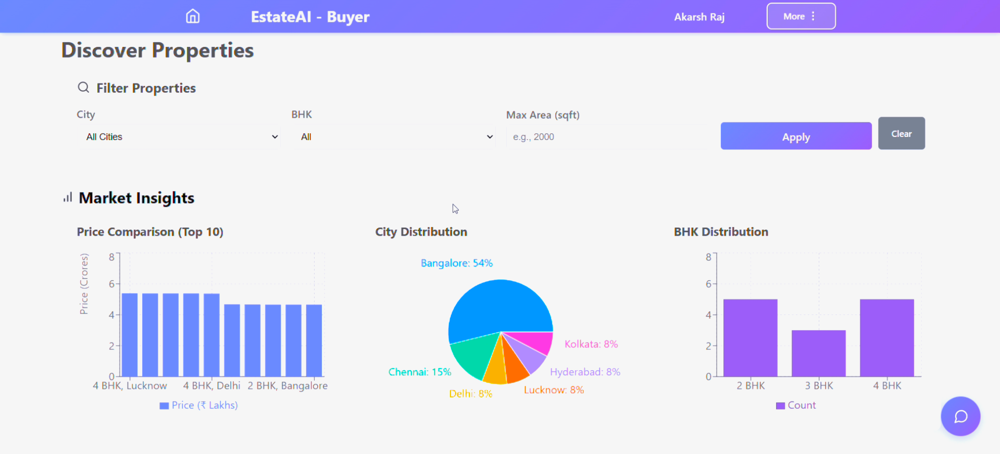
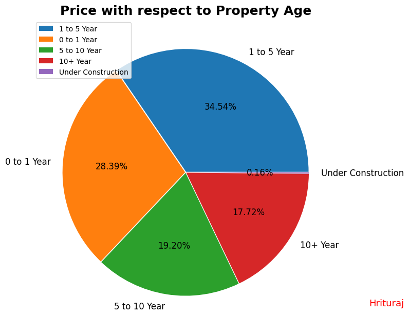
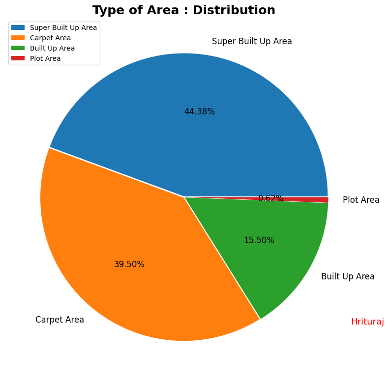
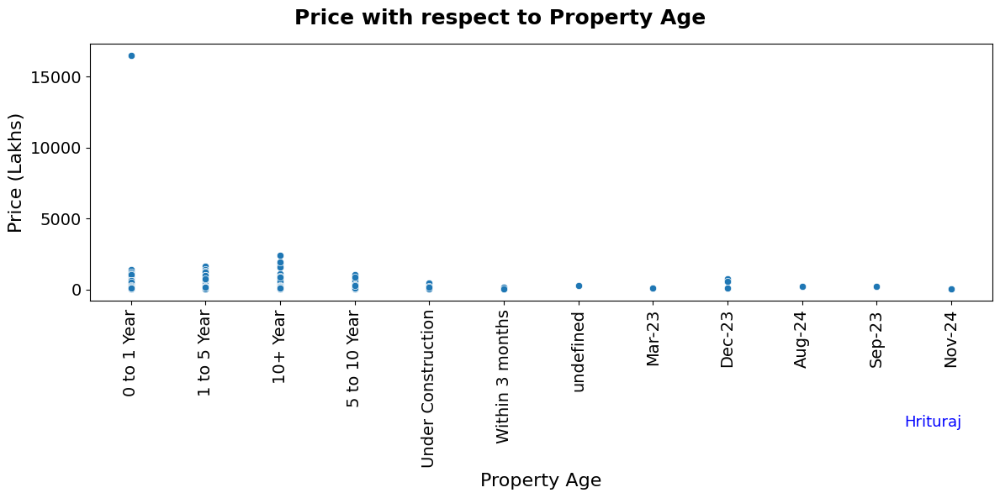
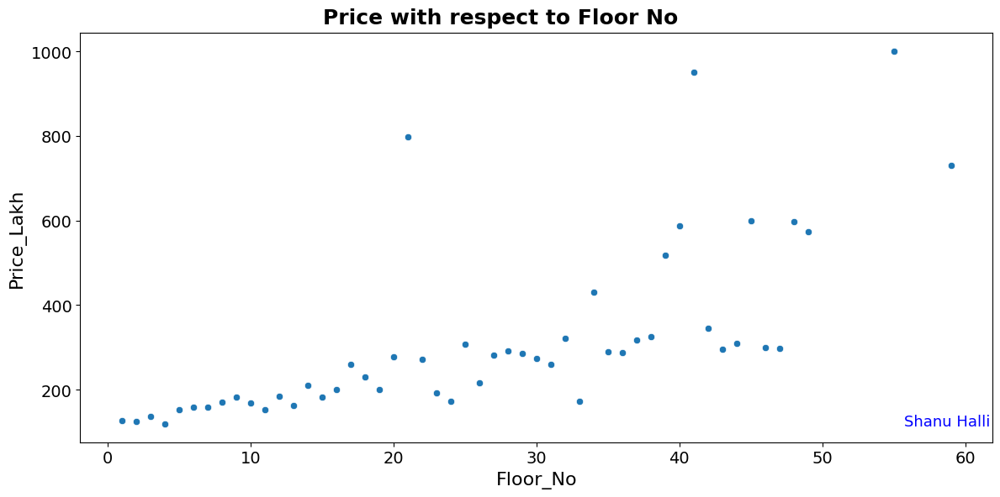
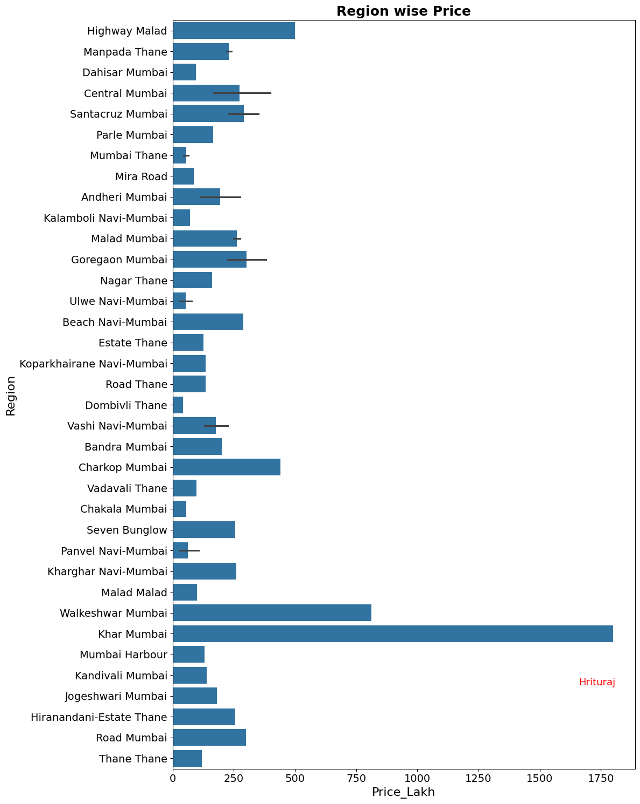

# 🏡AI-Based Real Estate Valuation System

The AI-Based Real Estate Valuation System is an end-to-end machine learning solution that predicts property prices based on features such as location, area, bedrooms, amenities and more. The platform empowers buyers and sellers with data-driven property valuations through an intuitive web interface.

### Key Capabilities

- 🤖 **ML-Powered Predictions** - Accurate price estimates using ensemble learning techniques.
- 📊 **Data Visualization** - Interactive charts and insights into real estate trends.
- 🎨 **Responsive UI** - Modern React-based interface for buyers and sellers.
- 🗺️ **Geographic Analysis** - Interactive India map showing regional property trends.
- 💰 **EMI Calculator** - Built-in loan planning tool.
- 💬 **AI Chatbot** - Intelligent assistant for property queries.

## 🖼️ Quick Glance

<p align="center">
  <br>
  <br>
  <br>
  <br>
  <br>
  <br>
</p>

## ✨ Features

### For Buyers
- View accurate property valuations.
- Save favorite listings.
- Calculate EMI and loan affordability.
- Explore properties by region using interactive maps.
- Get instant price predictions.

### For Sellers
- Estimate property value before listing.
- Understand market trends.
- Manage property listings.
- Access data-backed pricing recommendations.

### Additional Tools
- 🔐 Secure authentication system.
- 📈 Real-time price trend analysis.
- 🤖 Intelligent chatbot support.
- 📱 Fully responsive design.

## 🏗️ System Architecture

```
┌─────────────────────────────────────┐
│      React Frontend (Module 3)      │
│   (Buyer/Seller Dashboards)         │
└─────────────────┬───────────────────┘
                  │
                  │ HTTP/REST API
                  ▼
┌─────────────────────────────────────┐
│   ML Prediction API (Flask/Django)  │
│   (Uses regression_model.pkl)       │
└─────────────────┬───────────────────┘
                  │
                  │ Model Loading
                  ▼
┌─────────────────────────────────────┐
│   Machine Learning Pipeline         │
│   (Model Training & Evaluation)     │
└─────────────────┬───────────────────┘
                  │
                  │ Processed Data
                  ▼
┌─────────────────────────────────────┐
│   Data Preprocessing & EDA          │
│   (Cleaning, Feature Engineering)   │
└─────────────────────────────────────┘
```

## 🚀 Installation

### Prerequisites

- Python 3.8 or higher
- Node.js 14.x or higher
- npm or yarn
- Jupyter Notebook

### Step 1 - Clone the Repository

```bash
git clone https://github.com/iamhriturajsaha/AI-BASED-REAL-ESTATE-VALUATION-SYSTEM.git
cd AI-BASED-REAL-ESTATE-VALUATION-SYSTEM
```

### Step 2 - Set Up Python Environment

```bash
# Create virtual environment
python -m venv venv

# Activate virtual environment
# On Windows -
venv\Scripts\activate
# On macOS/Linux -
source venv/bin/activate
```

### Step 3 - Set Up Frontend

```bash
cd "UI (Module 3)"
npm install
npm start
```
The application will open at `http://localhost:3000`

## 💻 Usage

### Running Data Preprocessing & Visualization

```bash
# Navigate to Module 1
cd "Data Preprocessing & Data Visualization (Module 1)"

# Launch Jupyter Notebook
jupyter notebook

# Open and run -
# 1. Data Preprocessing.ipynb
# 2. EDA & Data Visualization.ipynb
```

### Training the Model

```bash
# Navigate to Module 2
cd "Model Building & Evaluation (Module 2)"

# Open the notebook
jupyter notebook "Model Building & Evaluation.ipynb"

# Run all cells to train and save the model
# Output - regression_model.pkl
```

## 📚 Modules

### Module 1 - Data Preprocessing & Visualization

**Key Tasks** -
- Data cleaning and missing value imputation.
- Categorical variable encoding.
- Feature scaling and normalization.
- Exploratory data analysis (EDA).
- Correlation analysis and visualization.

**Outputs** -
- Clean, processed dataset ready for modeling.
- Insights into price distributions, trends and relationships.

### Module 2 - Model Building & Evaluation

**Algorithms Tested** -
- Linear Regression.
- Random Forest Regressor.
- XGBoost Regressor.

**Techniques** -
- Hyperparameter tuning (GridSearchCV).
- K-fold cross-validation.
- Feature importance analysis.

**Evaluation Metrics** -
- Mean Absolute Error (MAE).
- Mean Squared Error (MSE).
- R² Score.

**Output** - `regression_model.pkl`(Serialized best-performing model).

### Module 3 - User Interface

**Components** -
- **Authentication** - Secure login/register system.
- **Buyer Dashboard** - Property search, valuations, favorites, EMI calculator.
- **Seller Dashboard** - Property listing and valuation tools.
- **Chatbot** - AI-powered property assistant.
- **Map Visualization** - Interactive geographic property trends.

## 🛠️ Technology Stack

### Data Science & ML
- **Python 3.8+** - Core programming language.
- **pandas & numpy** - Data manipulation.
- **scikit-learn** - Machine learning algorithms.
- **XGBoost** - Gradient boosting.
- **matplotlib & seaborn** - Data visualization.
- **Jupyter Notebook** - Development environment.

### Frontend
- **React.js** - UI framework.
- **Axios** - HTTP client.
- **CSS3** - Styling.
- **JavaScript ES6+** - Programming language.

## 📊 Model Performance

The final model demonstrates strong predictive capability - 

| Metric | Value |
|--------|-------|
| R² Score | 0.85+ |
| Mean Absolute Error | ~$15,000 |
| Root Mean Squared Error | ~$25,000 |

**Analysis**

<table>
  <tr>
    <td align="center"></td>
    <td align="center"></td>
  </tr>
  <tr>
    <td align="center"></td>
    <td align="center"></td>
  </tr>
  <tr>
    <td align="center"></td>
    <td align="center"></td>
  </tr>
</table>

**Key Insights** -
- Location and area are the strongest price predictors.
- Random Forest and XGBoost outperform linear models.
- Suburban areas show higher price variability.
- Model generalizes well across different property types.

